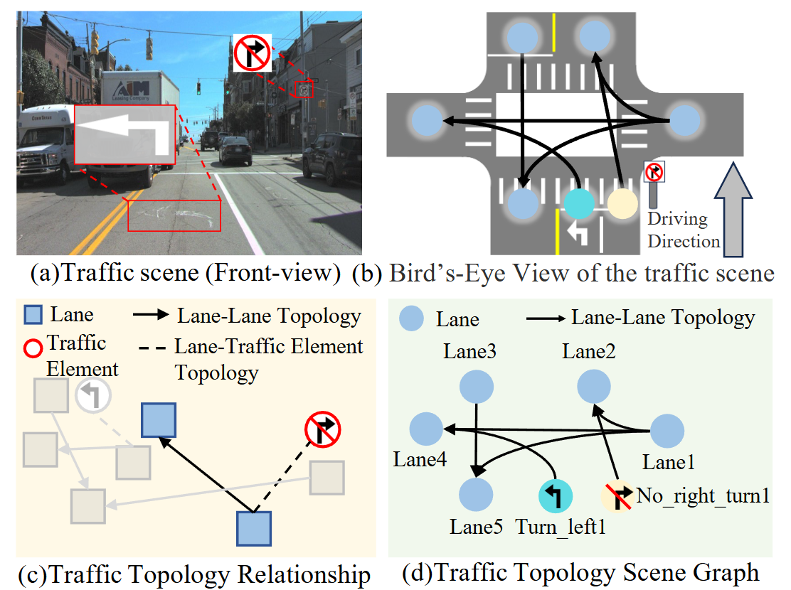
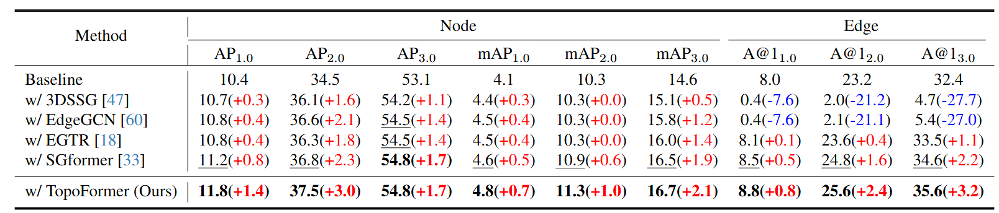
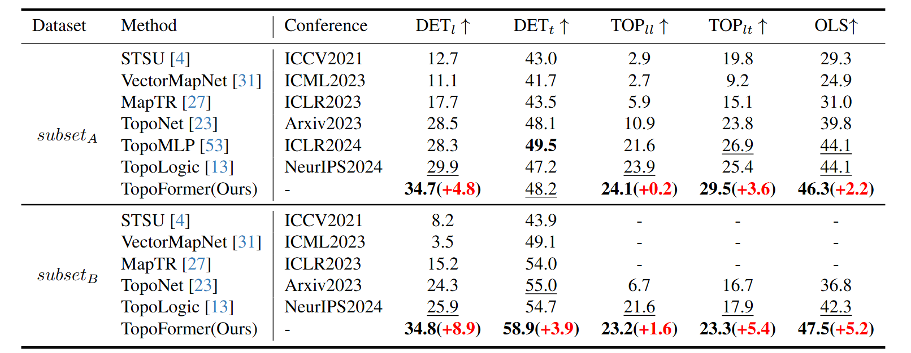

<div align="center" style="font-family: charter;">

<h1><i>T2SG</i>:</br> Traffic Topology Scene Graph for Topology Reasoning in Autonomous Driving</h1>

<a href="https://arxiv.org/pdf/2411.18894" target="_blank">
    
</a>

<div>
  <a href="https://scholar.google.com/citations?user=iFz5h28AAAAJ&hl=zh-CN" target="_blank">Changsheng Lv</a>,
  <a href="https://jueduilingdu.github.io/" target="_blank">Mengshi Qi</a><sup>*</sup>,
  <a href="https://teacher.bupt.edu.cn/liuliang/zh_CN/zhym/60714/list/index.htm" target="_blank">Liang Liu</a>,
  <a href="https://scholar.google.com/citations?user=A-vcjvUAAAAJ&hl=zh-CN" target="_blank">Huadong Ma</a>
</div>
<div style="font-size: small; color:rgb(255, 255, 255); margin-top: 4px;">
  <sup>†</sup> State Key Laboratory of Networking and Switching Technology, Beijing University of Posts and Telecommunications, China
</div>



<p align="justify"><i>In autonomous driving, understanding a traffic scene isn’t just about detecting lanes—it’s about grasping how lanes connect, why they are structured the way they are, and how traffic signals govern their use. Can current HD mapping methods build a coherent, structured representation that captures this logic? Or do they merely trace geometry without reasoning? We investigate these questions by introducing T2SG (Traffic Topology Scene Graph), a unified scene graph that explicitly models lane topology and signal-guided relationships,and propose TopoFormer, a one-stage transformer that generates such graphs through geometric aggregation and counterfactual structural reasoning. By evaluating on OpenLane-V2, we show not only that T²SG enables more accurate and explainable HD maps, but also that it significantly enhances downstream spatial reasoning for autonomous systems.</i></p>

</div>

## Release
- `2025-03-11` : Our paper `T2SG` is accepted by CVPR 2025 as Poster! See u in Nashville!

## Contents

- [Release](#relezase)
- [Contents](#contents)
- [Results](#results)
- [Getting Started](#getting-started)
  - [Prerequisites](#prerequisites)
  - [Train and Evaluate](#train-and-evaluate)
- [Acknowledgement](#acknowledgement)
- [Citation](#citation)


## Results

**Evaluation Setups:** We report comparative results between our model and the baselines on two tasks: traffic topology scene graph generation and OpenLaneV2.




## Getting Started

### Prerequisites

- Linux
- Python 3.8.20
- NVIDIA GPU + CUDA 11.1
- PyTorch 1.9.1+cu111
- torchvision 0.10.1+cu111
- mmcv-full 1.5.2, mmdet 2.26.0, mmdet3d 1.0.0rc6
- openlanev2 1.1.0

### Train and Evaluate

Set the environment variables before running the command.
```bash
export TORCH_HOME=work_dirs/
export PYTHONPATH=$PYTHONPATH:"./"
```

#### Train
Stage 1

```bash
./tools/dist_train.sh <WORK_DIR> 8
```

Stage 2(finetune)
```bash
./tools/dist_train_finetune.sh <WORK_DIR> 8
```

#### Evaluate
```bash
./tools/dist_test.sh <WORK_DIR> 8
```
> Note: <WORK_DIR>: path to save logs and checkpoints (e.g., work_dirs/exp_01)


## Acknowledgement

Our code is build upon [TopoNet](https://github.com/OpenDriveLab/TopoNet). We acknowledge their team for open-sourcing their implementation.

## Citation

If you find T2SG is useful in your research or applications, please consider citing it by the following BibTeX entry.
```
@InProceedings{Lv_2025_CVPR,
    author    = {Lv, Changsheng and Qi, Mengshi and Liu, Liang and Ma, Huadong},
    title     = {T2SG: Traffic Topology Scene Graph for Topology Reasoning in Autonomous Driving},
    booktitle = {Proceedings of the Computer Vision and Pattern Recognition Conference (CVPR)},
    month     = {June},
    year      = {2025},
    pages     = {17197-17206}
}
```
